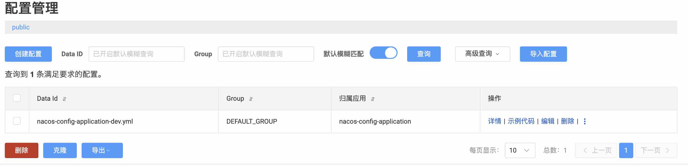

# 快速开始
1. 启动测试前,务必先启动 nacos server, 可参考官方文档安装部署: https://nacos.io/docs/latest/quickstart/quick-start-docker/
2. 在nacos server 控制台页面添加配置文件
  
3. 然后运行 `NacosConfigApplication`
4. 浏览器访问接口获取配置 :http://localhost:8080/config/get 观察响应结果

# 特别说明
> 按照nacos官方文档通过bootstrap方式配置, 单独使用nacos 作为配置中心时, 启动会报如下错误:

```text
Description:

No spring.config.import property has been defined

Action:

Add a spring.config.import=nacos: property to your configuration.
If configuration is not required add spring.config.import=optional:nacos: instead.
To disable this check, set spring.cloud.nacos.config.import-check.enabled=false.
```

解决办法:
1. 引入依赖
```xml
<dependency>
    <groupId>org.springframework.cloud</groupId>
    <artifactId>spring-cloud-starter-bootstrap</artifactId>
</dependency>
```
2.1 配置 `spring.config.import` 指定nacos实例, 例如:
```yaml
spring:
  application:
    name: nacos-config-application
  config:
    import: optional:nacos${spring.application.name}.${spring.cloud.nacos.config.file-extension}
  profiles:
    active: dev
  cloud:
    nacos:
      config:
        server-addr: 127.0.0.1:8848
        group: DEFAULT_GROUP
        file-extension: yml
```

2.2 或者禁用配置检查 `spring.cloud.nacos.config.import-check.enabled=false`, 例如:
```yaml
spring:
  application:
    name: nacos-config-application
  profiles:
    active: dev
  cloud:
    nacos:
      config:
        server-addr: 127.0.0.1:8848
        group: DEFAULT_GROUP
        file-extension: yml
        import-check:
          enabled: false
```